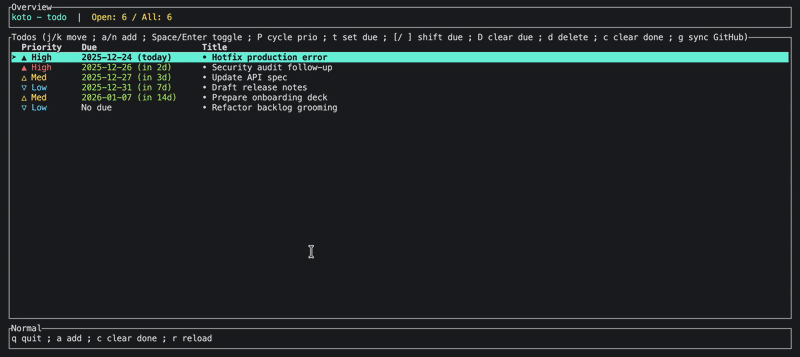

# koto

koto is a fast and minimal TUI todo manager with optional GitHub pull-request attention sync.

Named after the Japanese **事** *(koto)* — meaning "thing" or "action".



## Installation

```bash
# Install from local source
cargo install --path .

# Install from GitHub
cargo install --git https://github.com/kokoichi206/koto
```

After installation, you can run `koto` directly from anywhere.

## Usage

```bash
# If installed via cargo install
koto            # start with an empty list
koto --demo     # start with demo tasks

# Or run from source
cargo run --bin koto            # start with an empty list
cargo run --bin koto -- --demo  # start with demo tasks

# enable GitHub sync (env-first, falls back to `gh auth token`)
export GITHUB_TOKEN=ghp_xxx
koto            # press 'g' in the app to sync review-requested PRs

# or: use GitHub CLI auth (no env var required)
gh auth login
koto
```

### Key bindings

- `j` / `k` or `↓` / `↑`: move selection
- `a` or `n`: enter add mode (type then Enter to add)
- `Enter`: open link (if available) / otherwise toggle completion
- `Space`: toggle completion
- `d` / `Delete`: delete selected
- `c`: clear all completed
- `r`: reload
- `g`: sync GitHub PRs where you are requested as a reviewer
- `q`: quit

### GitHub sync notes

- Auth resolution order:
  - `GITHUB_TOKEN` (preferred)
  - `gh auth token` (requires `gh auth login` beforehand)
- If you use GitHub Enterprise, set `GH_HOST` (e.g. `github.example.com`) so `gh auth token --hostname $GH_HOST` is used.
- Press `g` to fetch PRs that explicitly request you as a reviewer; each PR is added as a todo: `owner/repo#num by author: title`.
- Runs in the background; header shows status while in progress.
